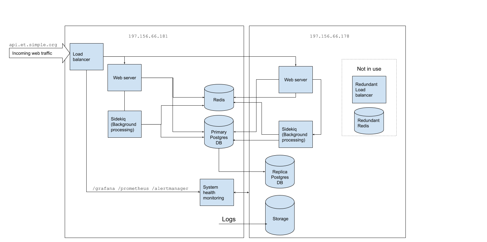

## Ethiopia contingency playbook

A guide for when something goes wrong on the self-managed standalone Ethiopia servers.

### Notes on configuration:
```
Box 1: 197.156.66.181
Box 2: 197.156.66.178
```



#### Load balancing:
- Both instances run an instance of HAProxy. `api.et.simple.org` currently points to `Box 1`. The second box's load balancer
is for redundancy and is unused.

#### Web server and sidekiq:
- Both boxes run an instance of the Rails webserver and sidekiq (for background job processing). At all times, these services need to talk to:
    - Primary Postgres DB
    - Redis

#### Postgres:
- Both boxes run an instance of postgres. Postgres on `Box 1` is the primary database. `Box 2` is a hot standby, which can be
  quickly promoted to primary in a contingency.

#### Logs:

All logs are shipped to `Box 2`. DB backups are periodically shipped to Box 2 as well.

### If `Box 1` dies

- Promote postgres replica on `Box 2` to become master; Change rails config to talk to postgres on `Box 2`.
    - (TODO: Add steps/commands here)
- Update Rails and Sidekiq config to talk to redis on `Box 2`.
- Setup monitoring daemons (grafana, prometheus) to run on `Box 2`.
- Point `api.et.simple.org` DNS in cloudflare to `Box 2`.

### If `Box 2` dies
- Nothing critical is affected, `simple-server` will continue to run smoothly. Postgres replication, logshipping will stop.
