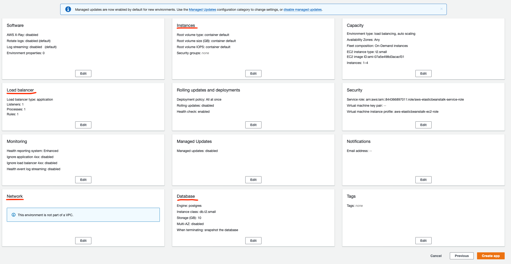
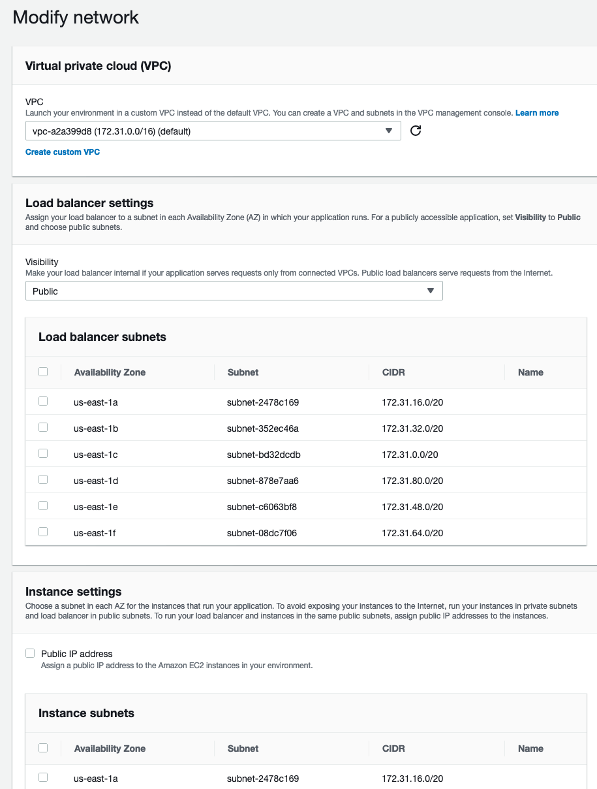
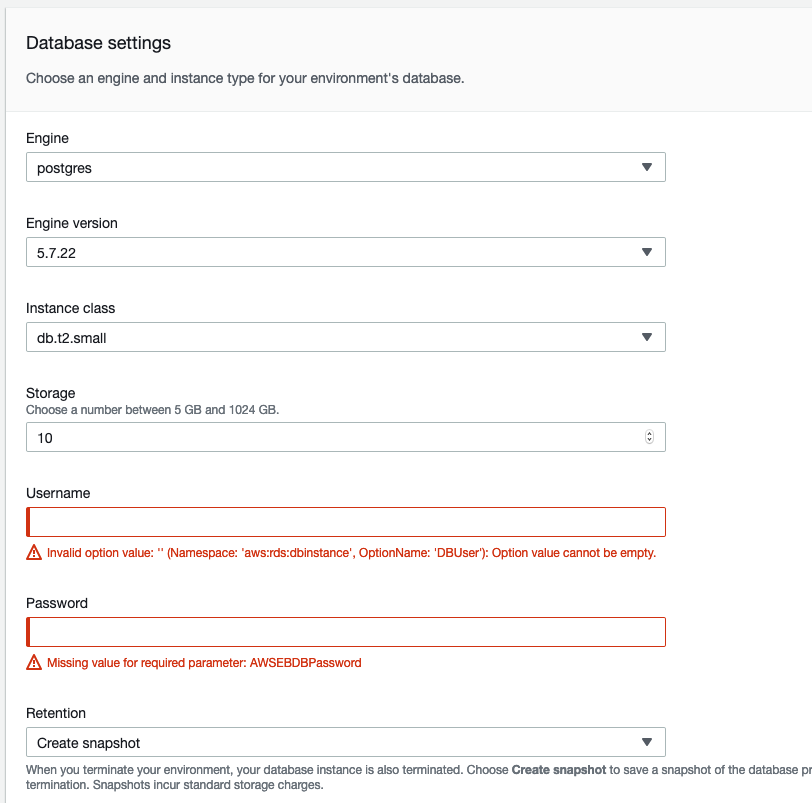

# Setting up Metabase on AWS

The instructions on [Metabase docs](https://www.metabase.com/docs/latest/operations-guide/running-metabase-on-elastic-beanstalk.html) are already quite good. This document is just a few salient points to assist the docs to fit with our infrastructure. The docs use Elastic Beanstalk, which runs Metabase in a docker container managed by AWS.

## Caveat Lector

* The entire Elastic Beanstalk UI is an SPA, so don't forget to save your changes before you launch your app in the intermediary steps and/or press the back button because you will have to start off the whole process again.
* While the app is launching, the progress bar gets stuck and doesn't show you the true progress and it might appear that it's taking too long. One way to validate its progress is to check if it has created the RDS instance or not. You can also refresh the page at this point and you might get a fresher state back.

## Quick Launch ([ref](https://www.metabase.com/docs/latest/operations-guide/running-metabase-on-elastic-beanstalk.html#quick-launch))

* Choose a descriptive name, like: `simple-metabase-sandbox`

## Base Configuration ([ref](https://www.metabase.com/docs/latest/operations-guide/running-metabase-on-elastic-beanstalk.html#base-configuration))

* In the Application Code field, select Upload Code
* If your region is Mumbai (India), do not choose the default S3 URL, it's unsupported
* Download Metabase from [here](https://s3.amazonaws.com/downloads.metabase.com/v0.35.3/metabase-aws-eb.zip) (the latest is `0.35.3` at the time of writing this) instead, and hit `Upload your code`

Hit `Review and Launch`. Once you do this, you will be redirected to a screen that looks like the following:

You only need to worry about the marked sections in the screenshot. Refer to the same screenshot above for the following sections:

### Network

* Select the default VPC.
* Select `Visibility: Public`.
* Select `Public IP Address: Yes`.
* Select `Instance Subnets: Select All`.
* Select `Database Subnets: Select All`.
* Hit `Save`

### Database

* Leave all the defaults be.
* Set a username and passsword for the database. Please store this in 1password.
* Hit `Save`.

### Load Balancer

* In `Application Load Balancer`, add a new port with `443` and `https` protocol.
* Select the `*.simple.org` certificate.
* Select the `ELBSecurityPolicy-TLS-1-2-2017-01` as the SSL policy.
* Hit `Save`.

### Instances

* Select the Security Group, choose the one that your app/db are in, for eg., for SBX it'd be: `sg_simple_server_development-sandbox`

 

Once you've configured all these, click on `Launch App` and wait.

## DNS

You've already setup the SSL policy and specified the cert. Go in and add the generated IPV4 address in CloudFlare under the appropriate CNAME you'd want this hosted.

Everything else should be self-explanatory if you're following the official Metabase docs. Even if you get something wrong, you can always launch the app and then configure it later.
